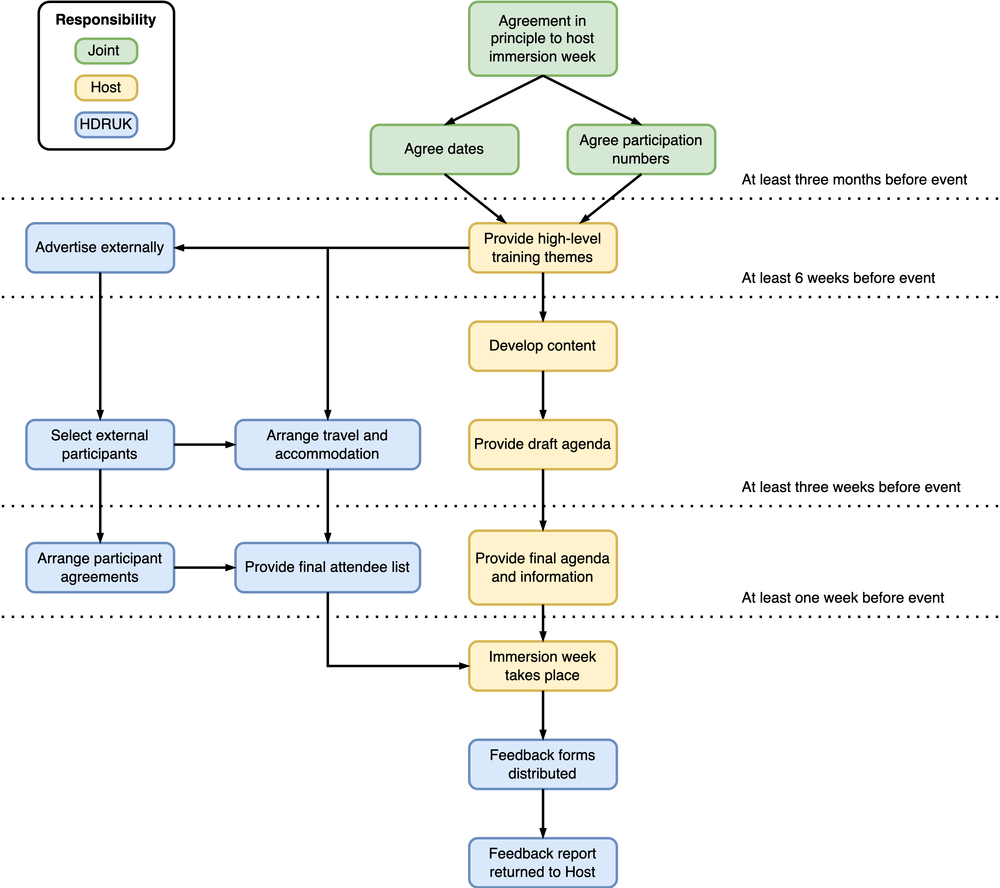

# Immersion Planning

** This information is for immersion week host organisation **

## About

Immersion weeks are 3-4 day residential events co-organised by HDRUK with a Host Organisation. The purpose of the immersion week is to introduce specific themes or topics of importance in health data science to HDRUK (and external) PhD students within the environment in which problem holders are based.

## Logistical arrangements

All travel, accommodation and subsistence costs for HDRUK PhD students are provided for by HDRUK. Non-HDRUK participants will be supported under different arrangement. 

Hosts will bear no responsibility for arranging or financially supporting travel, accommodation and subsistence. 

## Expected Timelines

|Time|Milestone|
|---|---|
|At least 3 months before event | Agreement in principle between Host and HDRUK to deliver the immmersion week |
|At least 6 weeks before event | Host to agree high-level training themes with HDRUK to advertise for any external participants. |
|At least 3 weeks before event| Host to provide draft agenda. HDRUK to arrange travel and accommodation.|
|At least 1 week before event| HDRUK to provide final participant list to Host. Host to provide final agenda and meeting information. |

## Planning flowchart

